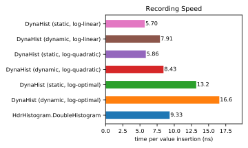
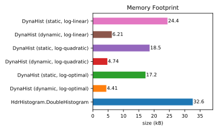
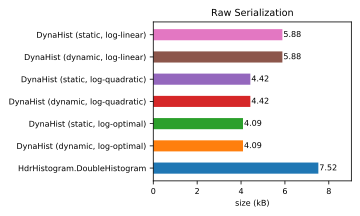

# DynaHist: A Dynamic Histogram Library for Java

[](https://circleci.com/gh/dynatrace-oss/dynahist/tree/master)
[](https://sonarcloud.io/dashboard?id=dynatrace-oss_dynahist)
[](https://sonarcloud.io/dashboard?id=dynatrace-oss_dynahist)
[](https://bintray.com/dynatrace/dynahist/com.dynatrace.dynahist)
[](https://javadoc.io/doc/com.dynatrace.dynahist/dynahist)
[](https://opensource.org/licenses/Apache-2.0)


This Java library contains histogram implementations with configurable bin layouts specifically designed for fast value recording. The basis are three different implementations:
* The static histogram enables an allocation-free recording of values, as the internal bin count array is already fully occupied during construction.
* The dynamic histogram is memory-efficient as it resizes the internal bin count array on demand. Furthermore, it dynamically adjusts the number of bits used for each counter.
* The preprocessed histogram is an immutable implementation which contains the cumulative bin counts. In this way sublinear queries for order statistics are possible through binary search. If many of those queries are performed subsequently, it is recommended to convert to a preprocessed histogram first.

The library ships with predefined bin layout implementations:
* `LogOptimalLayout`: Allows to specify absolute and relative bin width limits, where one of them must be satisfied over a given value range. In this way the error of recorded values can be controlled. This layout is most space-efficient but involves a logarithm evaluation.
* `LogLinearLayout`: Trades space for speed by replacing the logarithm of `LogOptimalLayout` by a piecewise linear function. For the same bin width limits this layout results in up to 44% more bins and therefore in a correspondingly larger memory footprint.
* `LogOptimalLayout`: This layout is a compromise between `LogOptimalLayout` and `LogLinearLayout`. It uses a piecewise quadratic approximation to reduce the space overhead to about 8% compared to the optimal mapping. 
* `CustomLayout`: Allows to set the bin boundaries individually. It can be used to map a histogram, which was recorded with some fine-grained bin layout, to a coarser custom bin layout with well-defined bins. For example, this can be useful as a preparatory step for creating a visualization of the histogram. This mapping should not be used for high-frequency recording as it involves a slow binary search.

## Basic Functionality

```java

// Defining a bin layout
Layout layout = LogQuadraticLayout.create(1e-5, 1e-2, -1e9, 1e9); // use bins with maximum 
                                                                  // absolute width of 1e-5 
                                                                  // or relative width of 1% 
                                                                  // to cover the range [-1e9, 1e9]
// Creating a dynamic histogram
Histogram histogram = Histogram.createDynamic(layout);             

// Adding values to the histogram
histogram.addValue(-5.5); // adds the value -5.5
histogram.addValue(4.3, 6); // adds the value 4.3 six times
histogram.addAscendingSequence(i -> i + 1, 1000000000); // adds the first billion positive integers

// Querying the histogram
histogram.getTotalCount();
histogram.getMin();
histogram.getMax();
histogram.getValue(1); // returns an estimate of the 2nd smallest value
histogram.getValue(3, ValueEstimator.UPPER_BOUND); // returns an upper bound of the 4th smallest value
histogram.getQuantile(0.5); // returns an estimate of the sample median
histogram.getQuantile(0.5, ValueEstimator.LOWER_BOUND); // returns a lower bound of the sample median

// Merging histograms
histogram.addHistogram(otherHistogram);

// Serialization
histogram.write(dataOutput); // write histogram to a java.io.DataOutput
histogram.readAsDynamic(layout, dataInput); // read dynamic histogram from a java.io.DataInput
```

## Getting Started

DynaHist is available as Maven package on [JCenter](https://bintray.com/dynatrace/dynahist) and should be used via Maven, Gradle or Ivy.
If automatic dependency management is not possible obtain the jar file from [GitHub Releases](https://github.com/dynatrace-oss/dynahist/releases).

## History
At [Dynatrace](https://www.dynatrace.com/) we were looking for a data sketch with a fast update time, which can also answer order statistic queries with error guarantees. As an example, such a data structure should be able to provide the 99th percentile with a maximum relative error of 1%. Other data structures like [t-digest](https://github.com/tdunning/t-digest) do not have strict error limits. In our search, we finally came across [HdrHistogram](https://github.com/HdrHistogram/HdrHistogram), a histogram implementation that intelligently selects bin boundaries so that 
the relative error is limited over a range of many orders of magnitude. The core of HdrHistogram is a fast mapping of values to bin indices by bit twiddling, which reduces the recording time to less than 10ns. Although we loved this idea, this data structure did not quite meet our requirements for several reasons:
  * The original HdrHistogram was designed for recording integer values. Usually we are dealing with floating point values. The wrapper class for `double` values, which is shipped with HdrHistogram, introduces an indirection, which slows down the recording.
  * Another disadvantage is that HdrHistogram does not give you full control over the error specification. It is only possible to define the number of significant digits corresponding to relative errors of 10%, 1%, 0.1%, etc. It is not possible to select a relative error of 5%. You must fall back on 1%, which unnecessarily increases the number of bins and wastes memory space.
  * HdrHistogram has no support for negative values. You have to use two histograms, one for the positive and one for the negative value range. 
  * With HdrHistogram it is not possible to define the maximum error for values that are between zero and the range where the relative error limit applies.
  * The mapping of values to bin indices is fast, but not optimal. The mapping used by HdrHistogram requires about 40% more bins than necessary to satisfy the specified relative error. In 2015 we have proposed a better and similarly fast mapping for HdrHistogram (see https://github.com/HdrHistogram/HdrHistogram/issues/54) with less than 10% space overhead. However, as this would have resulted in an incompatible change, the author of HdrHistogram decided not to pursue our idea any further.

Therefore, we started developing our own histogram data sketch which uses the proposed better mapping and which also solves all the mentioned issues. After many years of successful application and the emergence of an open source initiative at Dynatrace, we decided to publish this data structure as a separate library here on GitHub.

## Benchmarks
For our benchmarks we used random values drawn from a [reciprocal distribution](https://en.wikipedia.org/wiki/Reciprocal_distribution) (log-uniform distribution) with a minimum value of 1000 and a maximum value of 1e12. In order not to distort the test results, we have generated 1M random numbers in advance and kept them in main memory. For the comparison with HdrHistogram we used the `DoubleHistogram` with `highestToLowestValueRatio=1e9` and `numberOfSignificantValueDigits=2`. To record values with equivalent precision we used an absolute bin width limit of 10 and a relative bin width limit of 1% over the range [0, 1e12]. The corresponding layouts `LogLinearLayout(10, 0.01, 0, 1e12)`, `LogQuadraticLayout(10, 0.01, 0, 1e12)`, and `LogOptimal(10, 0.01, 0, 1e12)` have been combined with the static and dynamic implementations of DynaHist resulting in 6 different cases.

The recording speed was measured using [JMH](https://openjdk.java.net/projects/code-tools/jmh/) on a Dell Precision 5530 Notebook with an Intel Core i9-8950HK CPU. We measured the average time to insert the 1M random values into an empty histogram data structure, from which we derived the average time for recording a single value. All four investigated DynaHist variants outperform HdrHistogram's DoubleHistogram significantly. The static histogram implementation with the  `LogLinearLayout` was the fastest one and more than 35% faster than HdrHistogram.



The memory usage of the histogram data structures was analyzed after adding 1M random values as in the speed benchmark before. Again due to the better bin layout DynaHist significantly outperforms HdrHistogram. Especially the dynamic histogram implementation together with `LogOptimalLayout` or `LogQuadraticLayout` reduce the memory footprint by more than 85% compared to HdrHistogram.



Similarly, the serialization, which is more or less a memory snapshot of the dynamic histogram implementation, is much more compact than that of HdrHistogram.



The space advantage is maintained even with compression. The reason is that DynaHist requires much fewer bins to guarantee the same relative error and therefore less information has to be stored.


## Bin Layouts

A `Layout` specifies the bins of a histogram. The regular bins of a layout span a certain value range. In addition, DynaHist uses an underflow and an overflow bin to count the number of values which are below or beyond that value range, respectively. 

DynaHist comes with three `Layout` implementations `LogOptimalLayout`, `LogLinearLayout` and `LogQuadraticLayout` which can be configured using an absolute bin width limit `a` and a relative bin width limit `r`. If `b(i)` denotes the bin boundary between the `(i-1)`-th and the `i`-th bin, the `i`-th bin covers the interval `[b(i), b(i+1)]`. Then the absolute bin width limit can be expressed as 

    |b(i+1) - b(i)| <= a                                    (1)

and the relative bin width limit corresponds to

    |b(i+1) - b(i)| / max(|b(i)|, |b(i+1)|) <= r.           (2)

If a bin satisfies either (1) or (2), any point of `[b(i), b(i+1)]` approximates a recorded value mapped to the `i`-th bin with either a maximum absolute error of `a` or a maximum relative error of `r`. In particular, if the midpoint of the interval `(b(i) + b(i+1)) / 2` is chosen as estimate of the recorded value, the error is even limited by the absolute error bound `a/2` or the relative error bound `r/2`, respectively.

The bin boundaries of a layout, for which either (1) or (2) holds for all its bins, must satisfy

    b(i+1) <= b(i) + max(a, r * b(i))

in the positive value range. For simplicity, we focus on the positive value range. However, similar considerations can be made for the negative range. Obviously, an optimal mapping, that minimizes the number of bins and therefore the memory footprint, would have

    b(i+1) = b(i) + max(a, r * b(i)). 

We call bins close to zero and having a width of `a` subnormal bins. Normal bins are those representing an interval with larger values, which have a width defined by the relative bin width limit. The following figure shows an example of such a bin layout.

 

In this example, the bins are enumerated with integers from -9 to 8. The first and last bin indices address the underflow and the overflow bin, respectively. 
The widths of normal bins correspond to a [geometric sequence](https://en.wikipedia.org/wiki/Geometric_progression). 
For an optimal bin layout 

    b(i) = c * (1 + r)^i

must hold for all bin boundaries in the normal range with some constant `c`. Values of the normal range can be mapped to its corresponding bin index by the following mapping function

    f(v) := floor(g(v))    with    g(v) := (log(v) - log(c)) / log(1 + r).

While `log(1 + r)` and `log(c)` can be precomputed, the calculation of `log(v)` remains which is an expensive operation on CPUs. Therefore, DynaHist defines alternatives to the optimal mapping used by `LogOptimalLayout` that trade space efficiency for less computational costs. Obviously, if `g(v)` is replaced by any other function that is steeper over the whole value range, the error limits will be maintained. Therefore, DynaHist uses linear (`LogLinearLayout`) or quadratic (`LogQuadraticLayout`) piecewise functions instead. Each piece spans a range between powers of 2 `[2^k, 2^(k+1)]`. The coefficients of the polynomials are chosen such that the resulting piecewise function is continuous and the slope is always greater than or equal to that of `g(v)`. The theoretical space overhead of `LogLinearLayout` is about 44% and that of `LogQuadraticLayout` is about 8% compared to an optimal mapping.

## License

[Apache Version 2.0](https://github.com/dynatrace-oss/dynahist/blob/master/LICENSE)

## Main Contributors
* [Otmar Ertl](https://github.com/oertl)
* [Markus Remplbauer](https://github.com/markusremplbauer)
